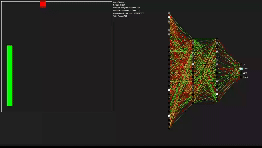
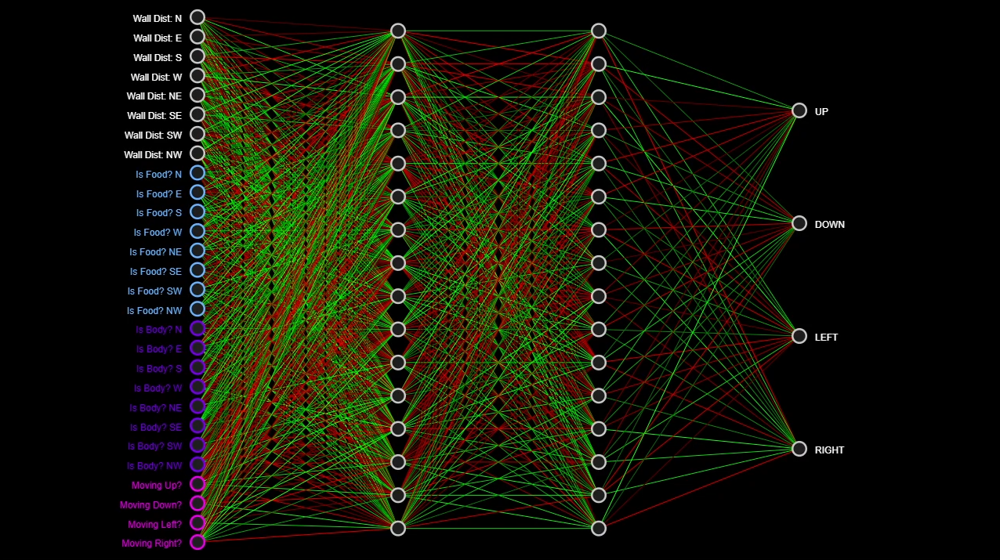
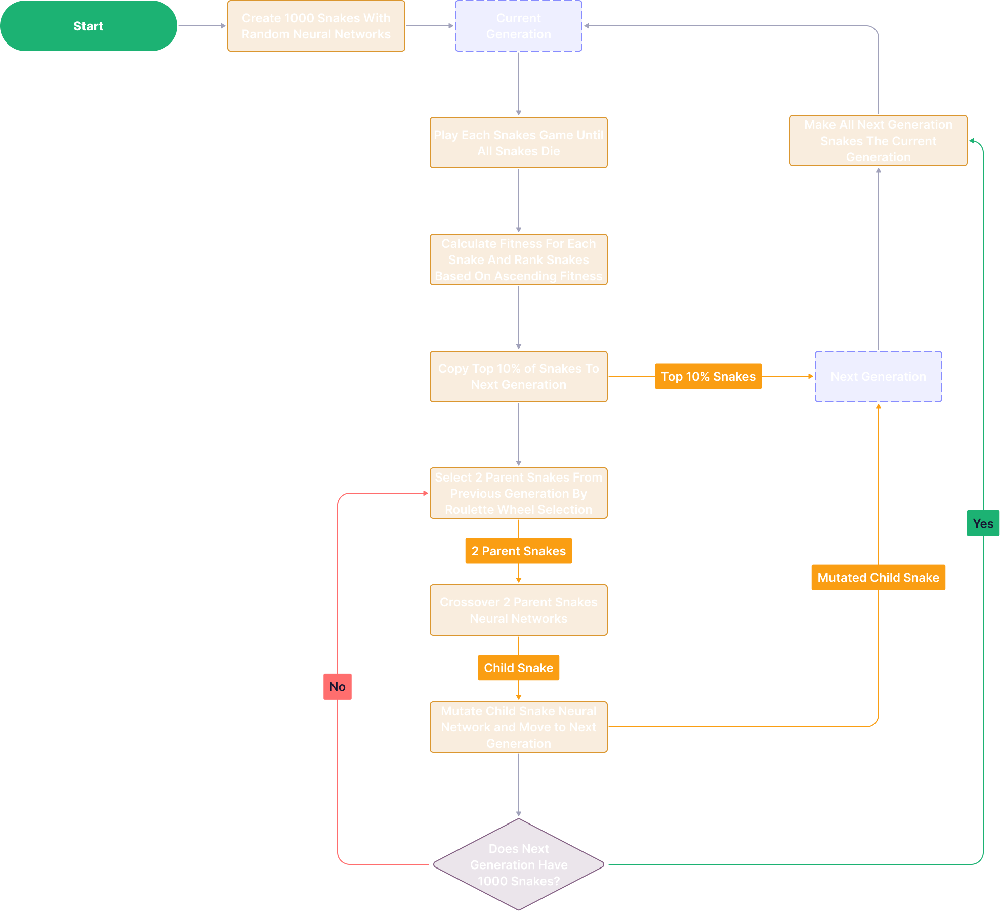
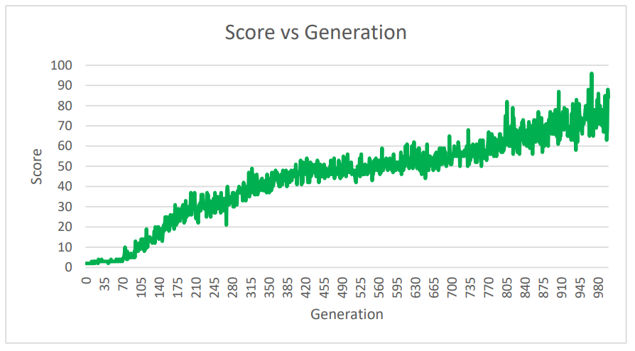

# 🐍 Snake AI  

 A Neural Network That Learns to Play Snake Using a Genetic Algorithm

  

## 🚀 Key Features  

### **24-Sensor Vision System**  
- The snake perceives its environment through **8 directional sensors**:  
  **N, S, W, E, NE, SE, SW, NW**  
- Each sensor detects:  
  - Distance to the wall  
  - Presence of food  
  - Its own tail  
- **Total Inputs:** `3 x 8 = 24 sensors`

  

### **Neural Network Decision Making**  
- The game state is processed through a **feedforward neural network**  
  **Architecture:** `24 (input) → 16 → 16 → 4 (output)`  
- The output with the highest activation determines the snake’s move  

  

### **Self-Learning via Genetic Algorithm**  
- **Evolution Process:**
  - The **top 10%** of snakes survive to the next generation  
  - The remaining **90%** are generated using:
    - **Roulette wheel selection** (choosing parents based on fitness)  
    - **Crossover** (combining parent weights)  
    - **Mutation** (random weight adjustments)  
  - Each generation consists of **1,000 snakes**  

  

### **Fitness Function**  
The AI is rewarded for **both survival and apple collection**:  
- **Longer survival** earns a linear reward  
- **Eating apples** gives an **exponential** bonus  

$$
\text{fitness} = \text{totalSteps} \cdot \text{score}^2
$$

## 📈 Peformance
After training for **1000 generations** with **1000 active agents** simulatenously, the AI managed to achieve a maximum score of `96` with a average score of `44.51`.

I believe if the AI was continued to be trained after generation 1000, it would continue to maximise the score even higher, however even running while running the training at **1000x** simulation speed, 1000 generations still took several hours to train with each generation becoming longer as the snake survives longer.

## 🛠️ Possible Future Improvements
In the future to possibly improve the peformance of this AI Snake, I would implement:
- **Dynamic Fitness Function Adjustments**
    - Modify the **fitness function** over time to shift priorities dynamically.
    - Early generations focus on **survival**, while later generations emphasize **seeking apples efficiently** to prevent the AI from taking unnecessarily long paths.

- **Memory Mechanism**  
  - Introduce a short-term memory buffer, allowing the AI to recall previous actions and outcomes.  
  - This could help prevent repeated mistakes and reinforce successful behaviors.  

## 📥 Download & Run  

🔗 **[Download Here](https://github.com/marchchris/SnakeGeneticAI/tree/fc39bd07b3be70b2887ffb65be67748dedfd9712/src)**  

Clone the repo and run it locally to watch the AI evolve over time! 🚀  

## 🎥 Related  

📺 **Watch the full explanation & demo on YouTube:**  
[▶️ Neural Network Snake AI Video](https://youtu.be/iqisOpNVir8?si=l0bohj50Q8YSrfJT)  
