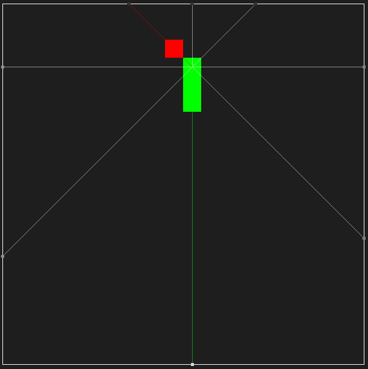
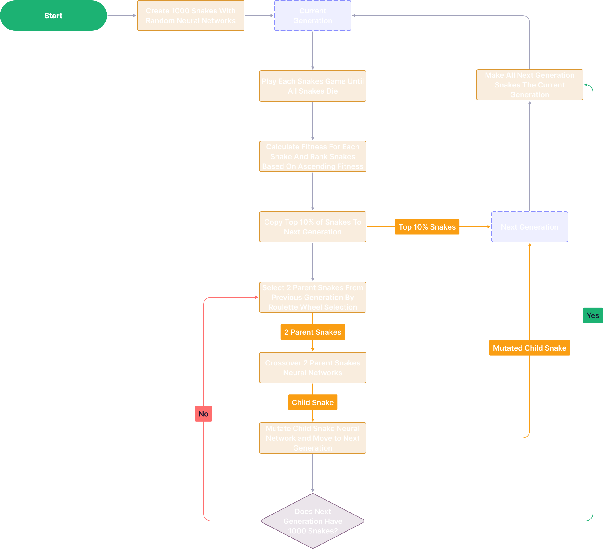

<h1 align="center">
   
   
  Snake AI
   
</h1>

<h4 align="center">Neural Network Learns To Play Snake By Genetic Algorithm</h4>

  

## Key Features

* **Snake Has 24 Sensors**
  - The Snake can see in 8 directions, N, S, W, E, NE, SE, SW, NW.
  - In each of these directions the snake can see distance to wall, if there is food, or if there is its tail.
  - 3 x 8 = 24 total sensors.

  

  
  

* **Self Trained By Genetic Algorithm**
  - For each generation Top 10% of snakes immediately go to next generation.
  - To populate the other 90% of the next generation, 2 parents are chosen by roullete wheel selection from current generation ranked by fitness, and crossover networks and produce a child snake 
    - (Crossing over is just averaging weights of parent networks)
  - Then child snake is then mutated and placed into the next generation.
  - Each generation has 1000 snakes.
   
  

  
  

  

* **The Fitness Function** 
  - As my goal for the snake was top learn to survive for aslong as possible and achieve a score as high as possible. I settled on a fitness function that rewards simply surviving by avoiding walls, but exponentially rewards eating apples as the game progresses to continue incentivising seeking apples.

  $$
  \text{fitness} = \text{totalSteps} \cdot \text{score}^2
  $$

## Download

You can [download](https://github.com/marchchris/SnakeGeneticAI/tree/fc39bd07b3be70b2887ffb65be67748dedfd9712/src) the latest version of this project and run it for yourself to watch the snake learn and grow :)

## Related

If you want to learn more about this project I have created a youtube video demonstrating and explaining how the neural network and genetic algorithm works [here](https://youtu.be/iqisOpNVir8?si=l0bohj50Q8YSrfJT).